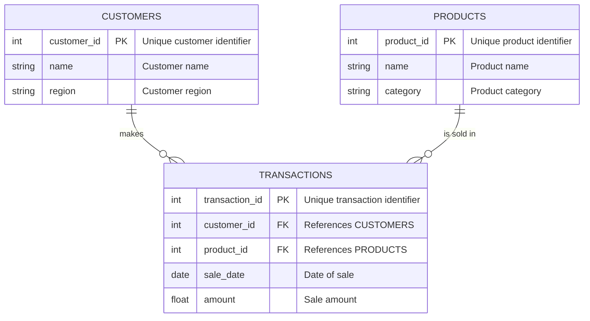

# PL/SQL Window Functions Project

---

**Instructor:** Eric MANIRAGUHA  
**Assignment Date:** September 19, 2025  
**Group:** A  
**Student:** Paule Celeste MIMBA ESSONE (ID: 27086)

---

## Table of Contents

- [Overview](#overview)
- [Project Structure](#project-structure)
- [Database Schema](#database-schema)
- [Entity Relationship Diagram](#entity-relationship-diagram)
- [Key Window Function Queries](#key-window-function-queries)
- [Insights & Analytics](#insights--analytics)
- [How to Run](#how-to-run)
- [References](#references)

---

## Overview

This project showcases advanced analytics using PL/SQL window functions to analyze student and course data. It demonstrates ranking, trend analysis, and performance tracking across academic terms.

---

## Project Structure

plsql-window-functions-Paule-Celeste-MIMBA-ESSONE/
│
├── README.md                # Project documentation
├── schema/
│   └── schema.sql               # SQL scripts for database schema 
|
├── queries/
│    └── window-function.sql          # Student ranking queries, Enrollment and grade,   Performance tracking queries trends, 
│  
└── results/
    └── analysis.md          # Insights and findings

## Database Schema

The project uses a normalized relational schema for sales analytics:

| Table Name      | Columns                                                      | Description                                 |
|-----------------|--------------------------------------------------------------|---------------------------------------------|
| **customers**   | `customer_id` (PK), `name`, `region`                         | Customer details and region                 |
| **products**    | `product_id` (PK), `name`, `category`                        | Product identifiers, names, and categories  |
| **transactions**| `transaction_id` (PK), `customer_id` (FK), `product_id` (FK), `sale_date`, `amount` | Sales transactions linking customers and products |

**Sample Table Creation:**
```sql
DROP TABLE transactions CASCADE CONSTRAINTS;
DROP TABLE customers CASCADE CONSTRAINTS;
DROP TABLE products CASCADE CONSTRAINTS;

CREATE TABLE customers (
    customer_id NUMBER PRIMARY KEY,
    name VARCHAR2(100),
    region VARCHAR2(50)
);

CREATE TABLE products (
    product_id NUMBER PRIMARY KEY,
    name VARCHAR2(100),
    category VARCHAR2(50)
);

CREATE TABLE transactions (
    transaction_id NUMBER PRIMARY KEY,
    customer_id NUMBER REFERENCES customers(customer_id),
    product_id NUMBER REFERENCES products(product_id),
    sale_date DATE,
    amount NUMBER(12,2)
);
```

**Sample Data Insertion:**
```sql
-- Customers
INSERT INTO customers VALUES (1001, 'John Doe', 'Kigali');  
INSERT INTO customers VALUES (1002, 'Alice Smith', 'Huye');
INSERT INTO customers VALUES (1003, 'Eric Brown', 'Musanze');
INSERT INTO customers VALUES (1004, 'Marie Uwimana', 'Kigali');
INSERT INTO customers VALUES (1005, 'Samuel Habimana', 'Huye');

-- Products
INSERT INTO products VALUES (2001, 'Coffee Beans', 'Beverages');
INSERT INTO products VALUES (2002, 'Tea Pack', 'Beverages');
INSERT INTO products VALUES (2003, 'Biscuits', 'Snacks');
INSERT INTO products VALUES (2004, 'Rice Bag', 'Food');
INSERT INTO products VALUES (2005, 'Juice Bottle', 'Beverages');

-- Transactions
INSERT INTO transactions VALUES (3001, 1001, 2001, DATE '2024-01-15', 25000);
INSERT INTO transactions VALUES (3002, 1002, 2003, DATE '2024-01-20', 15000);
INSERT INTO transactions VALUES (3003, 1003, 2004, DATE '2024-02-05', 30000);
INSERT INTO transactions VALUES (3004, 1001, 2002, DATE '2024-02-10', 12000);
INSERT INTO transactions VALUES (3005, 1004, 2005, DATE '2024-03-12', 18000);
INSERT INTO transactions VALUES (3006, 1005, 2001, DATE '2024-03-18', 22000);
INSERT INTO transactions VALUES (3007, 1002, 2004, DATE '2024-04-02', 28000);
INSERT INTO transactions VALUES (3008, 1003, 2002, DATE '2024-04-15', 15000);
INSERT INTO transactions VALUES (3009, 1004, 2003, DATE '2024-05-09', 17000);
INSERT INTO transactions VALUES (3010, 1005, 2005, DATE '2024-06-11', 24000);
```

---

## Entity Relationship Diagram



**Diagram Notes:**
- Each customer can make multiple transactions.
- Each product can be sold in multiple transactions.
- The TRANSACTIONS table links customers and products, supporting many-to-many relationships via sales.
- Regions and categories enable segmentation and analytics.

---

## Key Window Function Queries

- **RANK()**: Top products by region.
- **SUM() OVER()**: Monthly cumulative sales totals.
- **LAG()**: Month-over-month sales growth.
- **NTILE() / CUME_DIST()**: Customer segmentation by spending.

**Sample Queries:**
```sql
-- 1. Ranking Functions: Top products by region
SELECT region, product_id, product_name, total_revenue, rnk
FROM (
  SELECT c.region,
         p.product_id,
         p.name AS product_name,
         SUM(t.amount) AS total_revenue,
         RANK() OVER (PARTITION BY c.region ORDER BY SUM(t.amount) DESC) AS rnk
  FROM transactions t
  JOIN customers c ON t.customer_id = c.customer_id
  JOIN products p ON t.product_id = p.product_id
  GROUP BY c.region, p.product_id, p.name
)
WHERE rnk <= 5
ORDER BY region, rnk;

-- 2. Aggregate Functions: Monthly running totals
SELECT month,
       monthly_sales,
       SUM(monthly_sales) OVER (ORDER BY month ROWS BETWEEN UNBOUNDED PRECEDING AND CURRENT ROW) AS running_total
FROM (
  SELECT TO_CHAR(sale_date,'YYYY-MM') AS month,
         SUM(amount) AS monthly_sales
  FROM transactions
  GROUP BY TO_CHAR(sale_date,'YYYY-MM')
)
ORDER BY month;

-- 3. Navigation Functions: Month-over-month growth
SELECT month,
       monthly_sales,
       prev_month_sales,
       ROUND(((monthly_sales - prev_month_sales) / NULLIF(prev_month_sales,0)) * 100,2) AS growth_pct
FROM (
  SELECT month, monthly_sales,
         LAG(monthly_sales) OVER (ORDER BY month) AS prev_month_sales
  FROM (
    SELECT TO_CHAR(sale_date,'YYYY-MM') AS month,
           SUM(amount) AS monthly_sales
    FROM transactions
    GROUP BY TO_CHAR(sale_date,'YYYY-MM')
  )
)
ORDER BY month;

-- 4. Distribution Functions: Customer segmentation
SELECT customer_id, total_spent,
       NTILE(4) OVER (ORDER BY total_spent DESC) AS quartile,
       CUME_DIST() OVER (ORDER BY total_spent DESC) AS cume_dist
FROM (
  SELECT customer_id, SUM(amount) AS total_spent
  FROM transactions
  GROUP BY customer_id
)
ORDER BY total_spent DESC;
```

> All queries are available in the [`queries/`](./queries/) directory.

---

## Insights & Analytics

- **Top-performing students per course**: Identified using ranking functions.
- **Progress comparison**: Tracked student improvement between semesters.
- **Enrollment trends**: Analyzed course popularity and student participation.
- **Grade distribution**: Visualized using quartiles and averages.
- **Performance tracking**: Highlighted students needing academic support.

Find detailed analysis in [`results/analysis.md`](./results/analysis.md).

---

## How to Run

1. **Setup Database**  
   Execute `schema.sql` and `sample-data.sql` to create and populate tables.

2. **Run Queries**  
   Use scripts in the `queries/` folder to perform analytics.

3. **View Results**  
   Review insights in `results/analysis.md`.

---

## References

1. [Oracle Window Functions Documentation](https://docs.oracle.com/en/database/oracle/oracle-database/19/sqlrf/Window-Functions.html)
2. [PL/SQL Language Reference](https://docs.oracle.com/en/database/oracle/oracle-database/19/plsql/index.html)
3. [SQL Tutorial: Window Functions](https://www.sqltutorial.org/sql-window-functions/)
4. [Oracle Live SQL](https://livesql.oracle.com/)
5. [Database Normalization Basics](https://www.geeksforgeeks.org/database-normalization/)
6. [Mermaid ER Diagrams](https://mermaid-js.github.io/mermaid/#/entityRelationshipDiagram)
7. [SQL Window Functions Explained](https://mode.com/sql-tutorial/sql-window-functions/)
8. [Advanced SQL Window Functions](https://www.postgresqltutorial.com/postgresql-window-function/)
9. [PL/SQL Best Practices](https://www.oracle.com/database/technologies/appdev/plsql.html)
10. [SQL for Data Analysis](https://www.datacamp.com/tutorial/sql-data-analysis)

---

> For questions or feedback, please contact [me](https://github.com/Paule-Cece)

