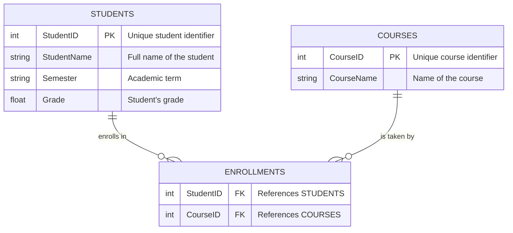

# PL/SQL Window Functions Project

---

**Instructor:** Eric MANIRAGUHA  
**Assignment Date:** September 19, 2025  
**Group:** A  
**Student:** Paule Celeste MIMBA ESSONE (ID: 27086)

---

## Table of Contents

- [Overview](#overview)
- [Project Structure](#project-structure)
- [Database Schema](#database-schema)
- [Entity Relationship Diagram](#entity-relationship-diagram)
- [Key Window Function Queries](#key-window-function-queries)
- [Insights & Analytics](#insights--analytics)
- [How to Run](#how-to-run)
- [References](#references)

---

## Overview

This project showcases advanced analytics using PL/SQL window functions to analyze student and course data. It demonstrates ranking, trend analysis, and performance tracking across academic terms.

---

## Project Structure

```
plsql-window-functions-Paule-Celeste-MIMBA-ESSONE/
│
├── README.md                # Project documentation
├── schema/
│   └── schema.sql               # SQL scripts for database schema 
|
├── queries/
│    └── window-function.sql          # Student ranking queries, Enrollment and grade,   Performance tracking queries trends, 
│  
└── results/
    └── analysis.md          # Insights and findings
```

---

## Database Schema

The project uses a normalized relational schema:

| Table Name     | Columns                                         | Description                                   |
|----------------|-------------------------------------------------|-----------------------------------------------|
| **Students**   | `StudentID` (PK), `StudentName`, `Semester`, `Grade` | Student details, academic term, and grades    |
| **Courses**    | `CourseID` (PK), `CourseName`                   | Course identifiers and names                   |
| **Enrollments**| `StudentID` (FK), `CourseID` (FK)               | Maps students to their enrolled courses        |

---

## Entity Relationship Diagram



**Diagram Notes:**
- Each student can enroll in multiple courses per semester.
- Each course can have multiple enrolled students.
- The ENROLLMENTS table links students and courses, supporting many-to-many relationships.
- Grades are tracked per student per semester.
- All foreign key relationships are clearly indicated.

---

## Key Window Function Queries

- **ROW_NUMBER()**: Ranks students by course enrollment.
- **RANK()**: Handles ties in student performance.
- **LAG() / LEAD()**: Compares student grades across semesters.
- **DENSE_RANK()**: Assigns ranks without gaps for grade analysis.
- **NTILE()**: Divides students into performance quartiles.
- **SUM() OVER()**: Calculates cumulative grades per semester.
- **AVG() OVER()**: Computes moving averages for grades.
- **FIRST_VALUE() / LAST_VALUE()**: Tracks grade changes over time.

> All queries are available in the [`queries/`](./queries/) directory.

---

## Insights & Analytics

- **Top-performing students per course**: Identified using ranking functions.
- **Progress comparison**: Tracked student improvement between semesters.
- **Enrollment trends**: Analyzed course popularity and student participation.
- **Grade distribution**: Visualized using quartiles and averages.
- **Performance tracking**: Highlighted students needing academic support.

Find detailed analysis in [`results/analysis.md`](./results/analysis.md).

---

## How to Run

1. **Setup Database**  
   Execute `schema.sql` and `sample-data.sql` to create and populate tables.

2. **Run Queries**  
   Use scripts in the `queries/` folder to perform analytics.

3. **View Results**  
   Review insights in `results/analysis.md`.

---

## References

1. [Oracle Window Functions Documentation](https://docs.oracle.com/en/database/oracle/oracle-database/19/sqlrf/Window-Functions.html)
2. [PL/SQL Language Reference](https://docs.oracle.com/en/database/oracle/oracle-database/19/plsql/index.html)
3. [SQL Tutorial: Window Functions](https://www.sqltutorial.org/sql-window-functions/)
4. [Oracle Live SQL](https://livesql.oracle.com/)
5. [Database Normalization Basics](https://www.geeksforgeeks.org/database-normalization/)
6. [Mermaid ER Diagrams](https://mermaid-js.github.io/mermaid/#/entityRelationshipDiagram)
7. [SQL Window Functions Explained](https://mode.com/sql-tutorial/sql-window-functions/)
8. [Advanced SQL Window Functions](https://www.postgresqltutorial.com/postgresql-window-function/)
9. [PL/SQL Best Practices](https://www.oracle.com/database/technologies/appdev/plsql.html)
10. [SQL for Data Analysis](https://www.datacamp.com/tutorial/sql-data-analysis)

---

> For questions or feedback, please contact the project author.

